# Power BI Portfolio — Weekly National Sales Report
**Álvaro Cuadros Sánchez** · Data Analytics & Business Intelligence

---

## Project Overview

**Report Name:** Weekly National Sales Report V3.1 — Delta + Odoo DM  
**Tool:** Microsoft Power BI  
**Industry:** Consumer Goods / Mass Market Retail (Copelme S.A.)  
**Scope:** National sales performance tracking across 9 departments in Bolivia  
**Data Sources:** Odoo ERP (operational data) + Delta (sales targets)  
**Last Refresh:** April 4, 2026

This report was designed to provide real-time visibility into commercial performance at a national level, enabling data-driven decisions by sales supervisors, regional managers, and the General Management. It integrates two data sources — the ERP system (Odoo) and the budget planning tool (Delta) — to deliver a unified view of actuals vs. targets.

---

## Report Pages

---

### Page 1 · Cover
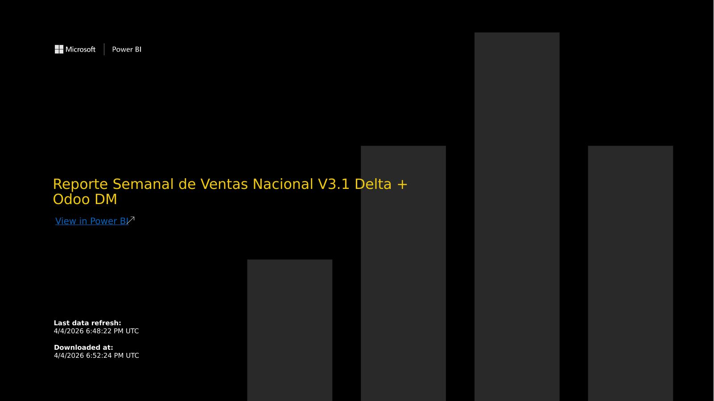

Entry slide with branding, report title, and last data refresh timestamp. Designed for executive distribution and quick identification of report version.

---

### Page 2 · Budget vs. Progress (Presup Vs. Avance)
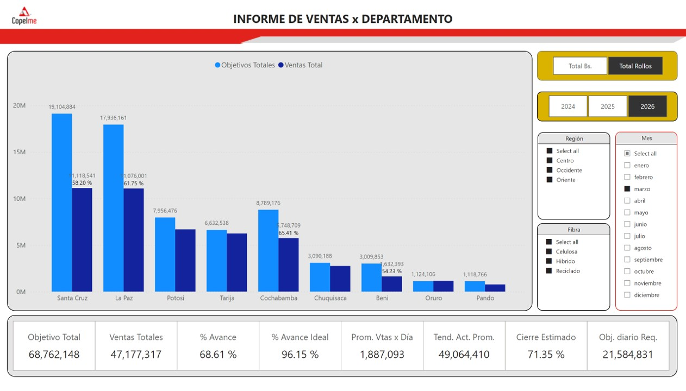

**Purpose:** National overview of sales performance vs. monthly budget targets.

**Key metrics displayed:**
- Total Target (Objetivo Total): Bs. 68,762,148
- Total Sales (Ventas Totales): Bs. 47,177,317
- % Progress: 68.61%
- Ideal Progress Benchmark: 96.15%
- Daily Sales Average: Bs. 1,887,093
- Estimated Closing: 71.35%

**Visuals:** Clustered bar chart comparing targets vs. actuals by department (Santa Cruz, La Paz, Potosí, Tarija, Cochabamba, Chuquisaca, Beni, Oruro, Pando).  
**Filters:** Region, Month, Fiber type, Year (2024–2026).

---

### Page 3 · Detailed Product Family (Familia Detallada)
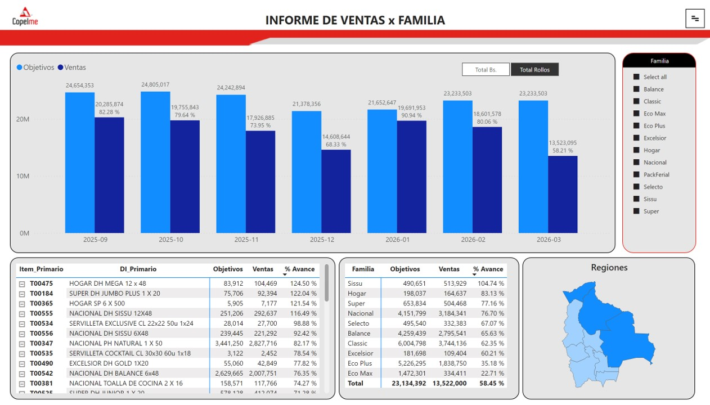

**Purpose:** Breakdown of sales performance by product family and region using pivot tables.

**Visuals:** Pivot tables segmented by product family and region, with balance indicators.  
**Filters:** Family, Category, Region, Department, Channel, SKU, Fiber type.

---

### Page 4 · Budget Progress by SKU (Avance Presupuesto x SKU)
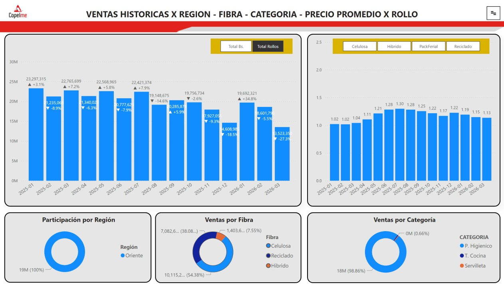

**Purpose:** Granular tracking of budget compliance at the individual product (SKU) level.

**Visuals:** Detailed pivot table with multi-dimensional filtering.  
**Filters:** Region, Month, Family, Category, Location, Department, Channel, Customer, Fiber type.

---

### Page 5 · Historical Sales (Ventas Históricas)
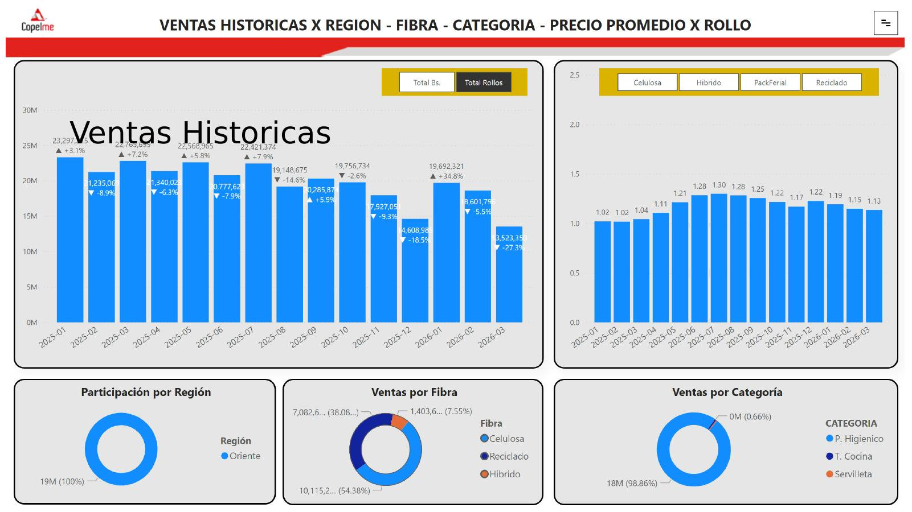

**Purpose:** Trend analysis of sales over time, allowing year-over-year comparison.

**Visuals:** Monthly sales line/bar chart, sales by category, regional participation breakdown, sales by fiber type.  
**Filters:** Region, Department, Month, Year, Channel, Family, Fiber type.

---

### Page 6 · Sales by Department (Ventas x Dpto.)
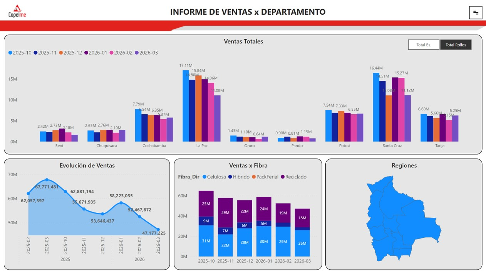

**Purpose:** Geographic performance analysis showing total sales and evolution by department.

**Visuals:** Regional map view, total sales cards, sales evolution chart, sales by fiber type.  
**Filters:** Region, Department, Month, Year, Channel, Fiber type.

---

### Page 7 · Daily Sales (Ventas Diarias)
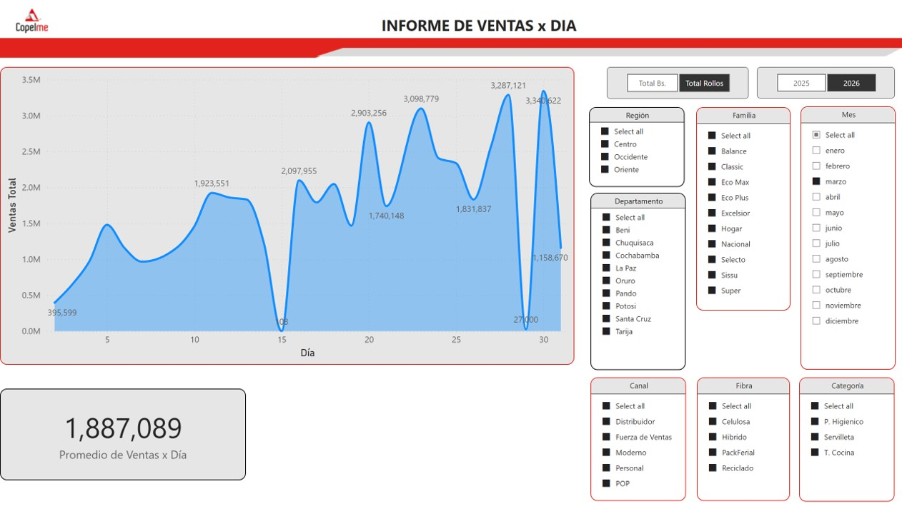

**Purpose:** Day-by-day sales tracking in rolls (physical units), enabling intra-month performance monitoring.

**Visuals:** Daily sales bar/line chart (units in rolls), KPI card.  
**Filters:** Region, Month, Family, Category, Department, Channel, Fiber type.

---

### Page 8 · Customers (Clientes)
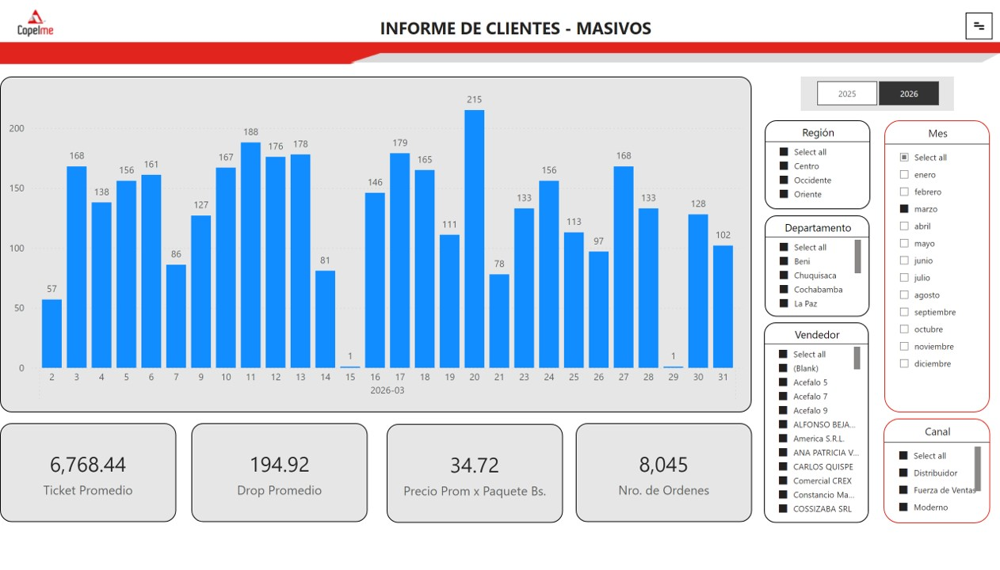

**Purpose:** Customer base analysis by salesperson, region, channel and department.

**Visuals:** Clustered column chart, 4 KPI cards (active customers, new customers, etc.), salesperson breakdown.  
**Filters:** Region, Month, Department, Channel.

---

### Page 9 · Supervisor Performance (Rend. x Supervisor)
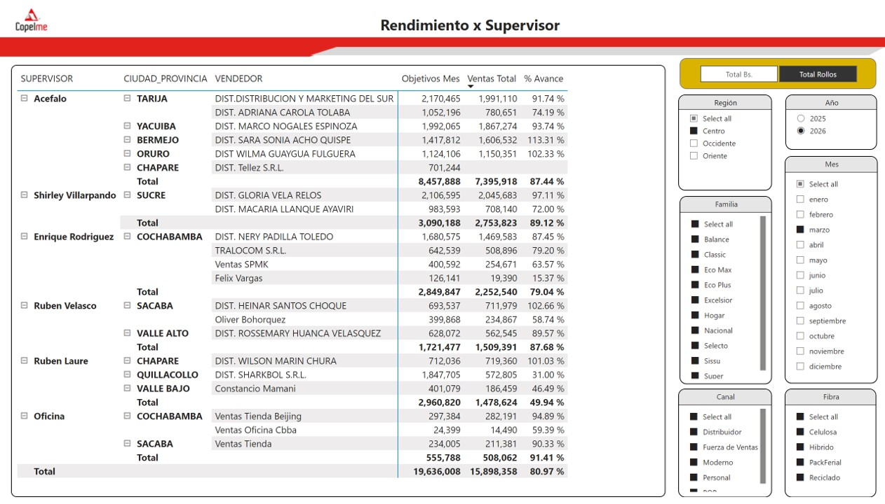

**Purpose:** Performance ranking and tracking of sales supervisors against their targets.

**Visuals:** Pivot table with supervisor-level metrics segmented by region, family and channel.  
**Filters:** Region, Year, Month, Family, Channel, Fiber type.

---

### Page 10 · Daily Report by Supervisor (Reporte Diario x Sup)
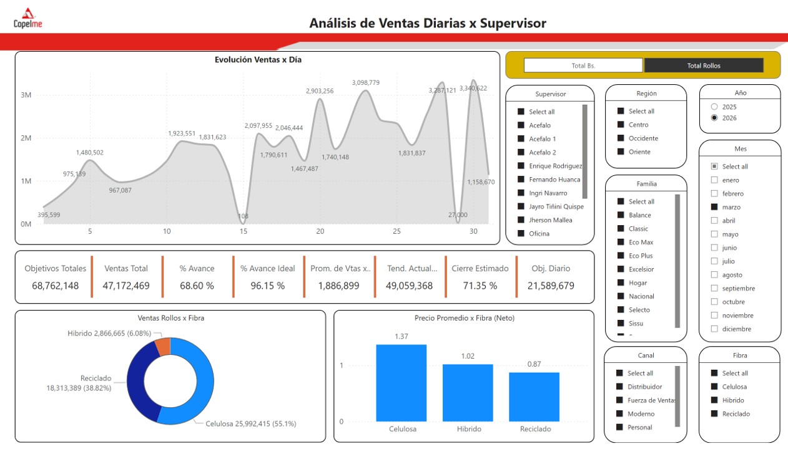

**Purpose:** Operational daily report for supervisors showing volume sold, average price, and daily sales evolution.

**Visuals:** Daily sales evolution line chart, rolls by fiber type, average net price by fiber type.  
**Filters:** Year, Month, Family, Channel, Fiber type, Supervisor, Region.

---

### Page 11 · Sales Force Project Performance (Rend. FFVV Proyecto)
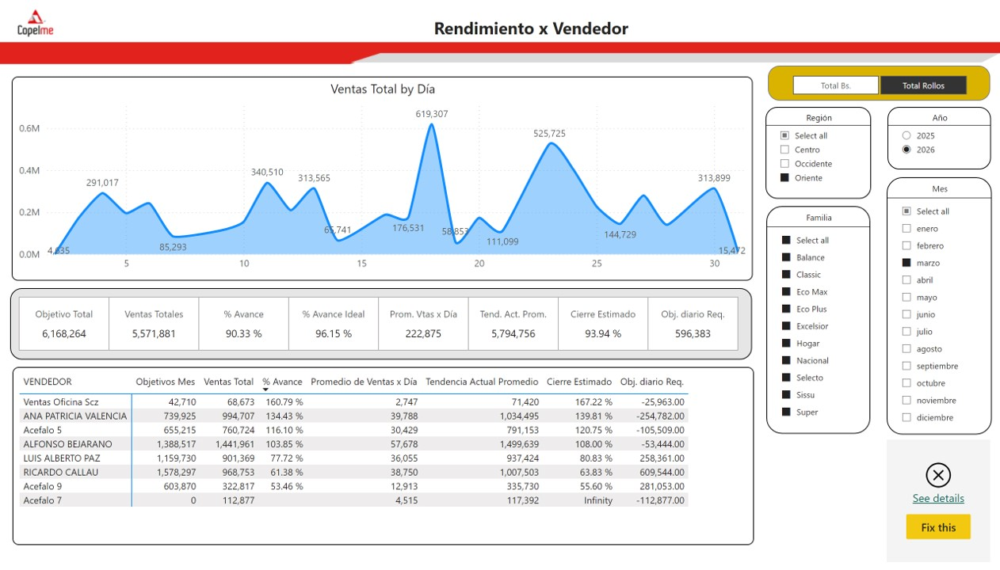

**Purpose:** Tracking of the field sales force performance against project-specific targets.

**Visuals:** Pivot table + line chart showing trend, with period-over-period comparison.  
**Filters:** Region, Year, Month, Family, Fiber type.

---

### Page 12 · Cochabamba Store (Tienda CBBA)
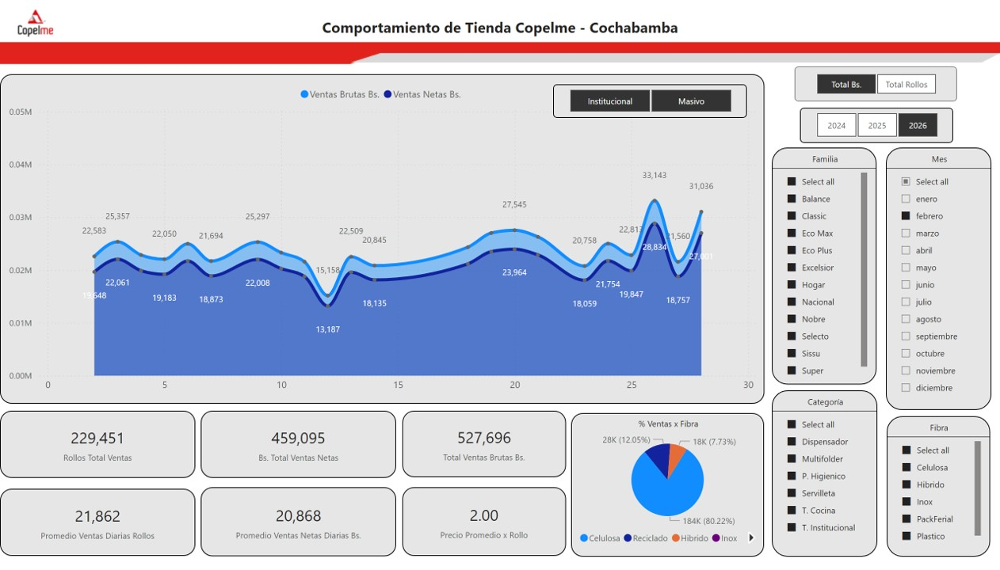

**Purpose:** Dedicated dashboard for the Cochabamba retail store with daily sales, fiber mix, and key KPIs.

**Visuals:** Daily sales bar chart, fiber type distribution (%), 6 KPI cards.  
**Filters:** Family, Month, Fiber type, Category.

---

### Page 13 · Accounts Receivable (CXC)
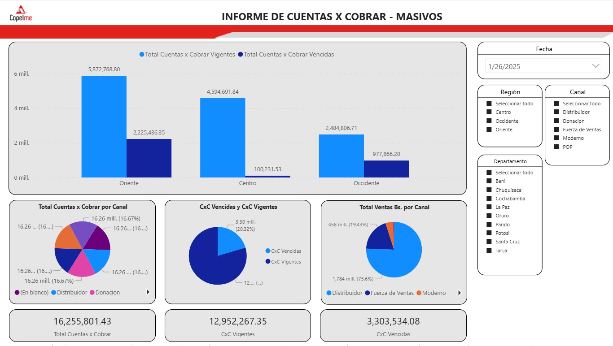

**Purpose:** Accounts receivable overview showing outstanding balances by region, channel and date.

**Visuals:** Clustered bar chart, two pie charts (by region and by channel), KPI card for total sales in Bs. by channel.  
**Filters:** Region, Canal, Department, Date.

---

### Page 14 · Historical Sales by SKU (Ventas Históricas x SKU)
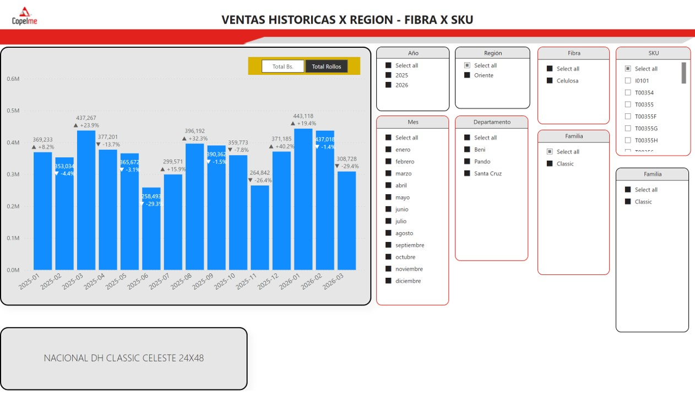

**Purpose:** Long-term historical sales trends broken down to the individual SKU level.

**Visuals:** Monthly sales chart per SKU, KPI card, family pivot breakdown.  
**Filters:** Region, Department, Fiber type, Year, Month, Family, SKU.

---

### Page 15 · Daily Comparison (Comparativo Diario)
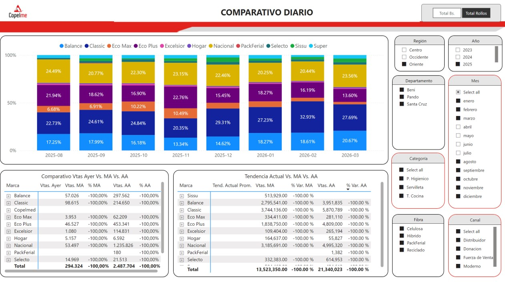

**Purpose:** Day-over-day comparison of sales versus same period last month (MA) and same period last year (AA).

**Visuals:** Historical sales line chart, yesterday vs. MA vs. AA comparison table, trend line (current vs. MA vs. AA).  
**Filters:** Channel, Department, Category, Month, Fiber type, Year, Region.

---

### Page 16 · Closing Trend by SKU (Tendencia Cierre x SKU)
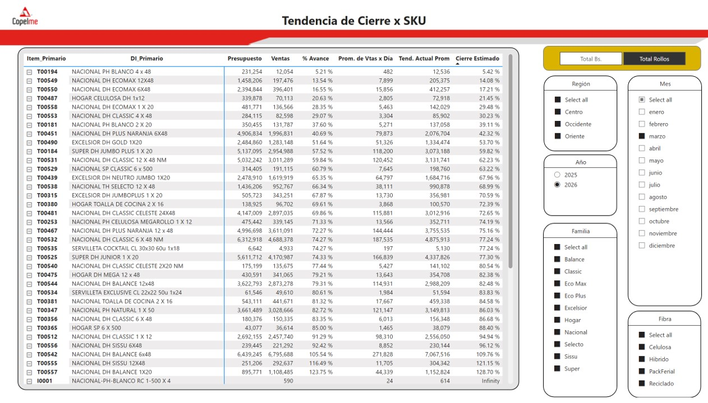

**Purpose:** Month-end closing forecast at the SKU level, enabling proactive commercial action before the period closes.

**Visuals:** Pivot table with closing trend projections per SKU.  
**Filters:** Year, Month, Family, Fiber type, Region.

---

## Technical Highlights

| Feature | Detail |
|---|---|
| Data integration | Odoo ERP + Delta planning tool (dual-source) |
| Report pages | 16 fully interactive pages |
| Visualization types | Clustered bar, line charts, pie charts, pivot tables, KPI cards, maps |
| Filter dimensions | Region, Department, Channel, Month, Year, Family, SKU, Fiber type, Supervisor, Customer |
| Refresh frequency | Weekly (automated) |
| Target audience | General Management, Regional Managers, Sales Supervisors |

## Skills Demonstrated

- End-to-end Power BI report development (data modeling, DAX measures, visual design)
- Integration of multiple data sources (ERP + planning systems)
- Dashboard design for executive and operational audiences
- KPI definition and commercial performance tracking
- Geographic sales analysis across national territory
- Supervisor and sales force performance management

---

*Álvaro Cuadros Sánchez · alvaro.cuadros.sanchez@gmail.com · +591 78000803 · Santa Cruz, Bolivia*
