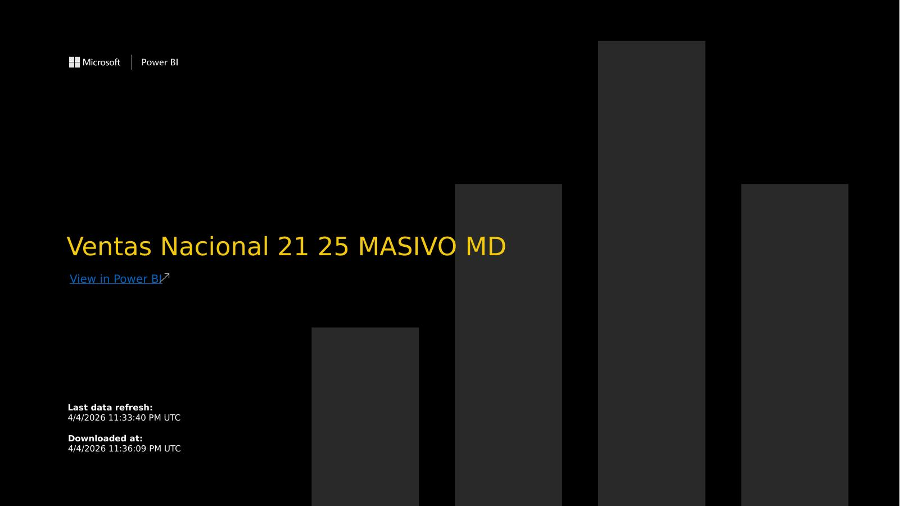
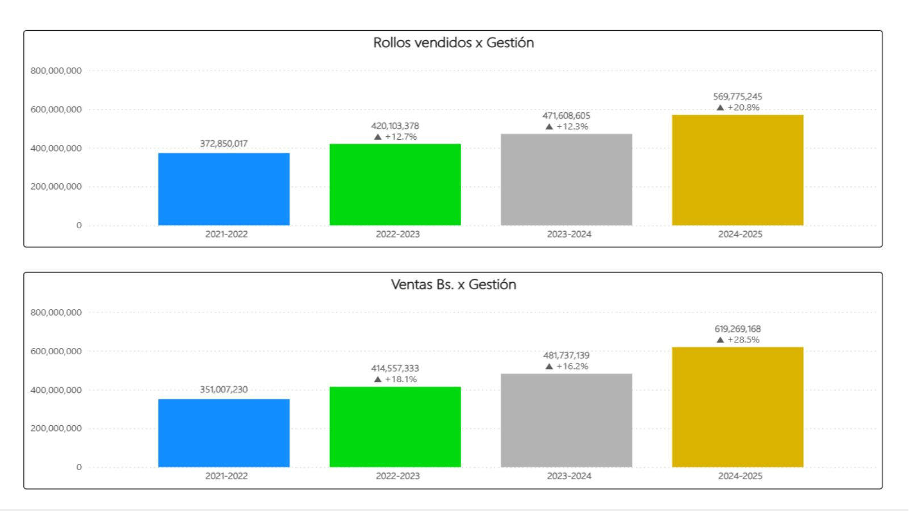
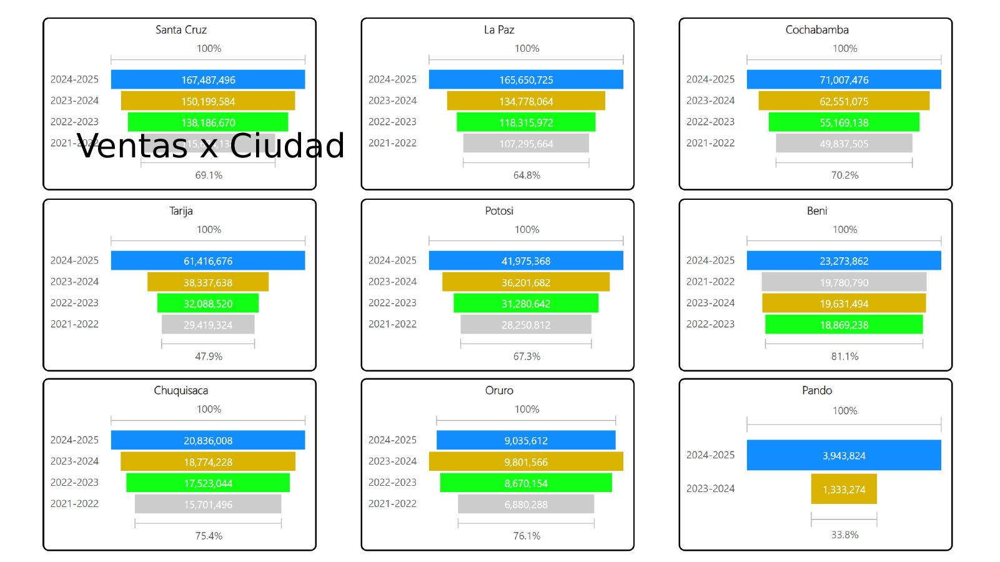
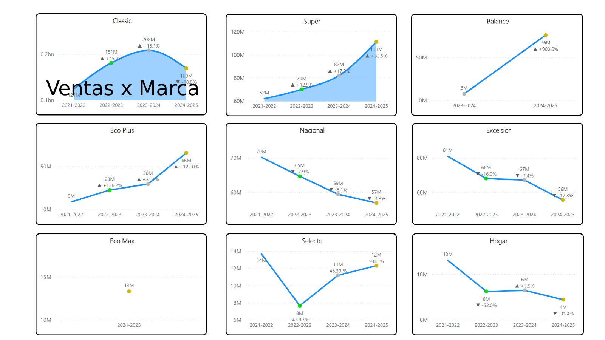
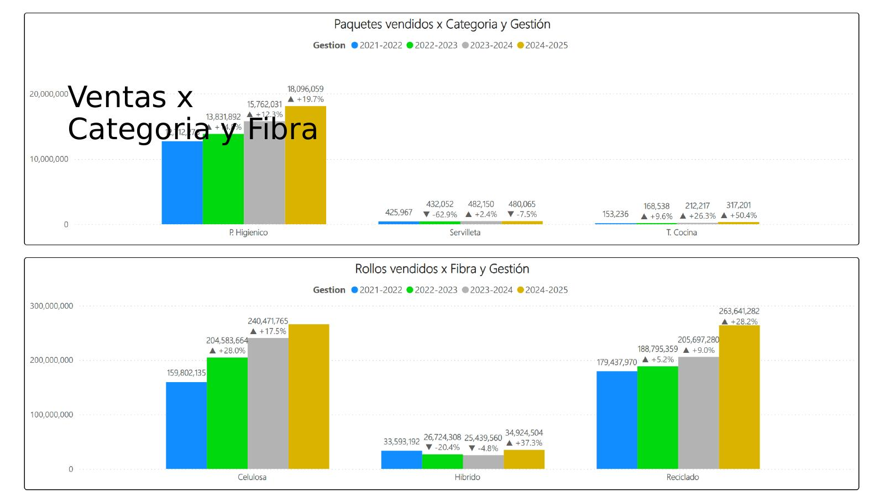
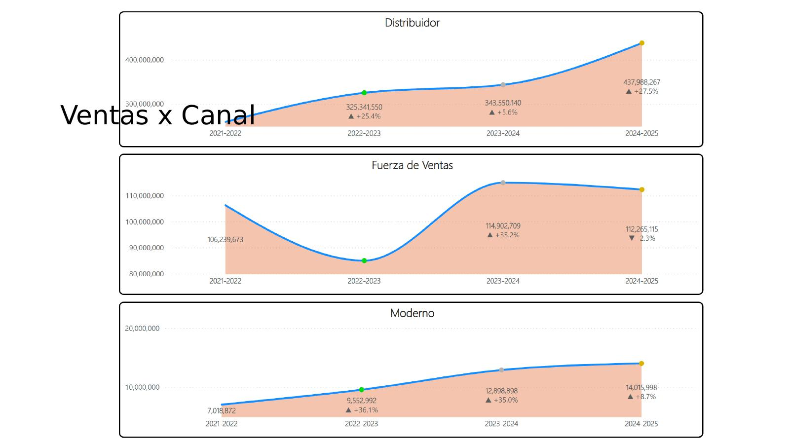
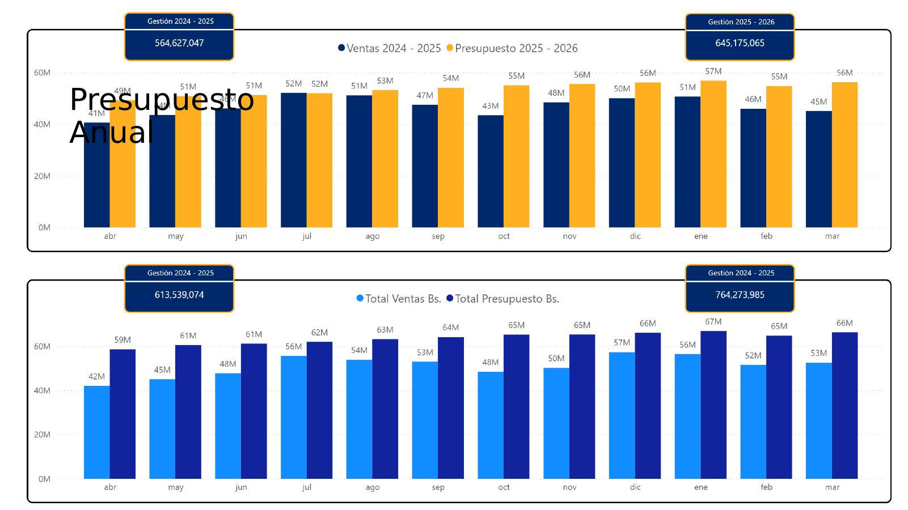
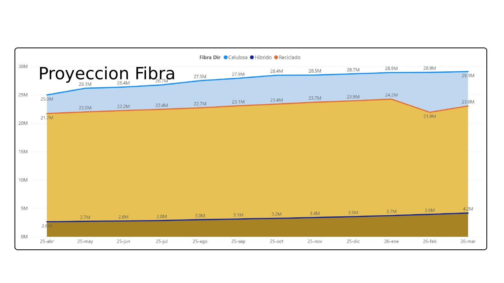
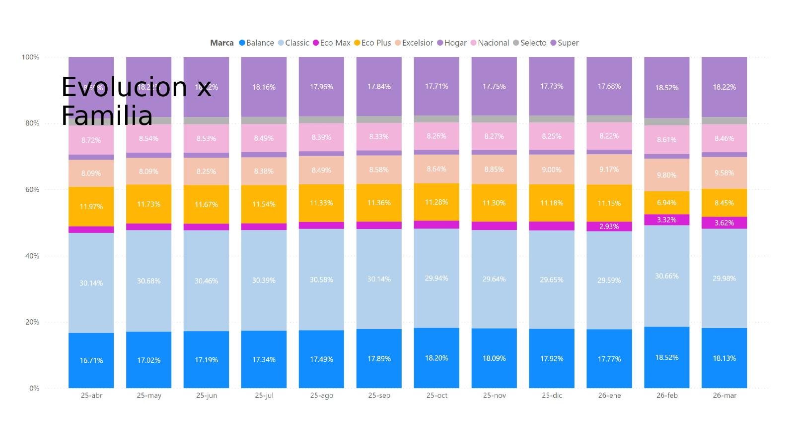
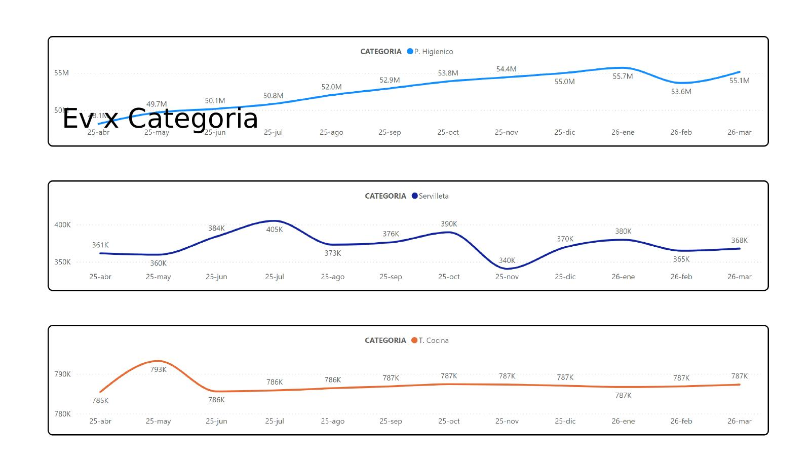

# Power BI Portfolio — National Sales Report 2021–2025
**Data Analytics & Business Intelligence**

---

## Project Overview

**Report Name:** National Sales 21–25 — Mass Market (MASIVO MD)
**Tool:** Microsoft Power BI
**Industry:** Consumer Goods / Mass Market Retail
**Scope:** National historical sales analysis across 9 departments in Bolivia (2021–2025)
**Data Sources:** ERP system + internal sales database
**Last Refresh:** April 4, 2026

This report provides a strategic 4-year view of commercial performance across all departments, brands, product categories, fiber types, and sales channels. It was built to support executive decision-making, annual budget planning, and portfolio strategy — enabling management to identify growth trends, underperforming brands, and channel dynamics over time.

---

## Report Pages

---

### Page 1 · Cover

Entry slide with branding, report title, and last data refresh timestamp. Designed for executive distribution.

---

### Page 2 · Sales by City — National Overview (Ventas x Ciudad)

**Purpose:** High-level national view of total rolls sold and total revenue in Bolivianos across fiscal years 2021–2025.

**Key metrics:**
- Total rolls sold grew from 372.8M (2021–22) to 569.8M (2024–25) — **+52.8% over 4 years**
- Total revenue in Bs. grew from 351.0M to 619.3M — **+76.4% over 4 years**
- Consistent year-over-year growth: +12.7%, +12.3%, +20.8% in rolls; +18.1%, +16.2%, +28.5% in revenue

**Visuals:** Dual clustered bar charts — rolls sold and revenue by fiscal year (2021–22 through 2024–25) with year-over-year growth indicators.

---

### Page 3 · Sales by City — Department Detail (Ventas x Ciudad)

**Purpose:** Department-level breakdown of sales performance across all 4 fiscal years, with growth percentage benchmarks.

**Key insights:**
- Santa Cruz leads nationally with Bs. 167.5M in 2024–25 (69.1% growth vs. base)
- La Paz second at Bs. 165.7M (64.8% growth)
- Cochabamba third at Bs. 71.0M (70.2% growth)
- Tarija shows the strongest relative growth at Bs. 61.4M (+47.9% above base)
- Pando emerging market with 33.8% cumulative growth

**Visuals:** 9 individual bar charts (one per department), each showing 4-year sales trend with growth benchmark.

---

### Page 4 · Sales by Brand (Ventas x Marca)

**Purpose:** Brand portfolio performance analysis — identifying growth brands, stable brands, and declining brands over 4 fiscal years.

**Key insights:**
- **Balance:** Fastest-growing brand at +900.6% (emerging/new brand)
- **Eco Plus:** Strong growth at +122.0% over the period
- **Super:** Solid growth at +35.5% reaching Bs. 111M
- **Classic:** Peaked at Bs. 208M in 2023–24, declining -18.8% in 2024–25
- **Nacional & Excelsior:** Declining trend — strategic review opportunity
- **Eco Max:** Single data point (2024–25 launch)

**Visuals:** 9 individual area/line charts per brand showing 4-year trend with growth rate annotations.

---

### Page 5 · Sales by Category and Fiber Type (Ventas x Categoría y Fibra)

**Purpose:** Volume analysis by product category (packs sold) and by fiber type (rolls sold) across all fiscal years.

**Key insights:**
- Toilet paper (P. Higiénico) dominates: 18.1M packs sold in 2024–25 (+19.7%)
- Kitchen towel (T. Cocina): fastest category growth at +50.4%
- Napkins (Servilleta): recovering after a -62.9% dip
- By fiber: Celulosa leads (240.5M rolls, +17.5%), Reciclado growing fastest (+28.2%)

**Visuals:** Dual clustered bar charts — packs by category and rolls by fiber type, with 4-year year-over-year comparison.

---

### Page 6 · Sales by Channel (Ventas x Canal)

**Purpose:** Channel strategy analysis showing performance evolution across Distributor, Sales Force, and Modern Trade channels.

**Key insights:**
- **Distribuidor:** Main and growing channel — Bs. 438.0M in 2024–25 (+27.5%)
- **Fuerza de Ventas:** Peaked at Bs. 114.9M in 2023–24, slightly declining (-2.3%) in 2024–25
- **Moderno:** Steadily growing from Bs. 7.0M to 14.0M (+8.7% latest year)

**Visuals:** 3 individual area charts per channel showing 4-year revenue trend.

---

### Page 7 · Annual Budget (Presupuesto Anual)

**Purpose:** Monthly budget vs. actuals comparison across two fiscal periods (2024–25 and 2025–26 target).

**Key metrics:**
- Fiscal 2024–25 actuals: Bs. 564.6M (rolls) / Bs. 613.5M (revenue)
- Fiscal 2025–26 budget target: Bs. 645.2M (rolls) / Bs. 764.3M (revenue)
- Monthly tracking from April through March

**Visuals:** Two dual clustered bar charts — one comparing rolls sold vs. budget by month, one comparing revenue vs. budget by month, with KPI cards for total actuals and targets.

---

### Page 8 · Fiber Projection (Proyección Fibra)

**Purpose:** Forward-looking projection of sales volume by fiber type (Celulosa, Reciclado, Híbrido) through fiscal year 2025–26.

**Key insights:**
- Celulosa projected to reach 29.1M by March 2026 (steady upward trend)
- Reciclado projected at 23.0M (dominant fiber by volume)
- Híbrido stable and growing to 4.2M

**Visuals:** Stacked area line chart showing monthly projection by fiber type from April 2025 to March 2026.

---

### Page 9 · Evolution by Family (Evolución x Familia)

**Purpose:** 100% stacked view of product family mix evolution over the 4-year period, revealing shifts in portfolio composition.

**Visuals:** 100% stacked bar chart showing family share per fiscal year.

---

### Page 10 · Evolution by Category (Ev x Categoría)

**Purpose:** Multi-line trend analysis of volume and revenue evolution by individual product category across the full historical period.

**Visuals:** 3 line charts showing category-level trends over time.

---

## Technical Highlights

| Feature | Detail |
|---|---|
| Historical coverage | 4 fiscal years (2021–22 through 2024–25) |
| Report pages | 10 fully interactive pages |
| Visualization types | Clustered bars, area charts, line charts, 100% stacked bars, KPI cards |
| Analysis dimensions | Department, Brand, Category, Fiber type, Channel, Fiscal year |
| Refresh frequency | Periodic (strategic/monthly) |
| Target audience | General Management, Commercial Directors, Finance |

## Skills Demonstrated

- Strategic multi-year sales analysis and trend identification
- Brand portfolio performance modeling (growth, decline, emerging brands)
- Channel strategy analysis and distribution mix evaluation
- Product category and fiber type volume tracking
- Budget vs. actuals monitoring with forward projection
- Executive-level dashboard design for commercial leadership

---

*Data Analytics & Business Intelligence Portfolio*
