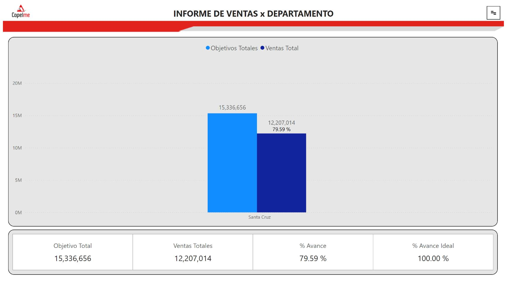
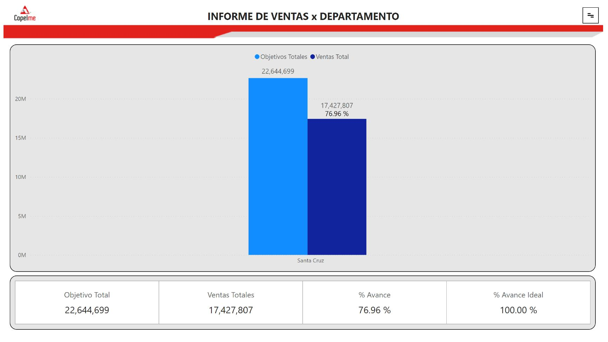
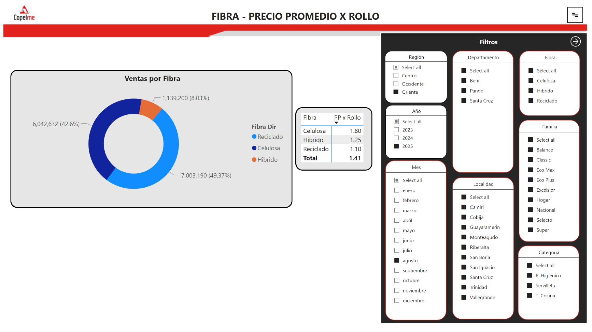
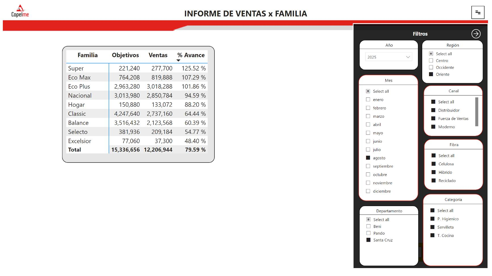
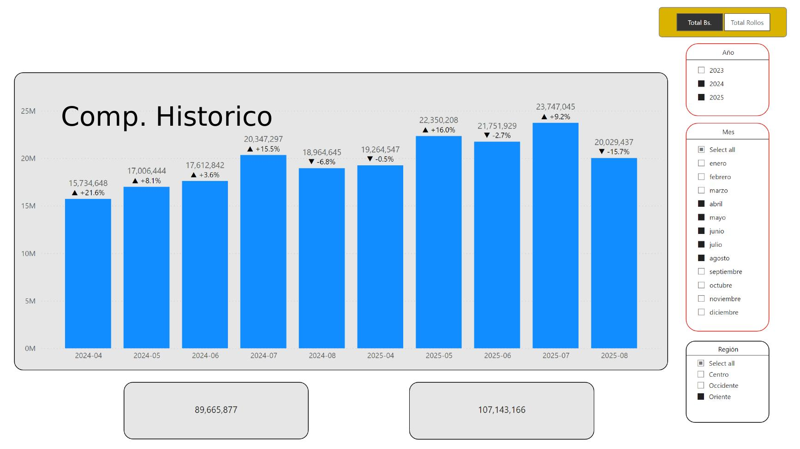
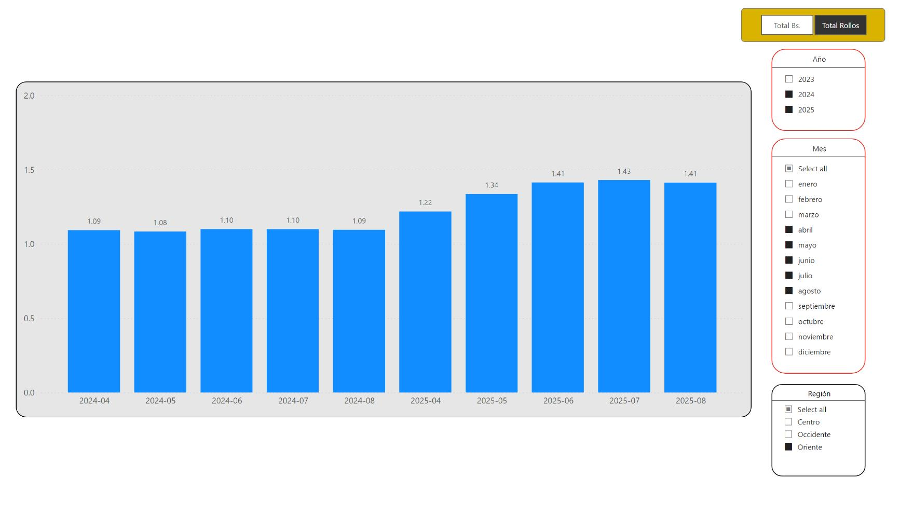

# Power BI Portfolio — Monthly Sales Report
**Data Analytics & Business Intelligence**

---

## Project Overview

**Report Name:** Monthly National Sales Report V1.0
**Tool:** Microsoft Power BI
**Industry:** Consumer Goods / Mass Market Retail (Copelme S.A.)
**Scope:** National monthly sales results presented to the Board of Directors
**Audience:** General Management and Board of Directors
**Last Refresh:** August 2025

This report is the primary commercial results deck presented monthly to the Board of Directors. It consolidates national sales performance across departments, product families, fiber types, and sales channels — providing the executive leadership with a clear, data-driven view of commercial operations. The report features an interactive filter panel (Filtros) on relevant pages, allowing dynamic slicing by region, department, month, year, channel, fiber type, family, and category directly during board presentations.

---

## Report Pages

---

### Page 1 · Monthly Sales — Rolls (Unit Volume)

**Purpose:** Top-level view of monthly unit sales performance vs. target in rolls, presented to the Board as the primary volume KPI.

**Key metrics displayed:**
- Total Target (Objetivo Total): 15,336,656 rolls
- Total Sales (Ventas Totales): 12,207,014 rolls
- % Progress (% Avance): 79.59%
- Ideal Progress Benchmark: 100.00%

**Visuals:** Clustered bar chart comparing target vs. actual rolls sold by department, with a KPI summary table below.
**Context:** Shown filtered to the Oriente region / Santa Cruz department for the August 2025 period.

---

### Page 2 · Monthly Sales — Revenue (Bs.)

**Purpose:** Revenue-side counterpart to Page 1 — tracks total sales in Bolivianos vs. monthly budget, the key financial KPI for board reporting.

**Key metrics displayed:**
- Total Target: Bs. 22,644,699
- Total Sales: Bs. 17,427,807
- % Progress: 76.96%
- Ideal Progress Benchmark: 100.00%

**Visuals:** Clustered bar chart (target vs. actuals in Bs.) by department, with KPI summary table.
**Note:** The delta between volume attainment (79.59%) and revenue attainment (76.96%) reflects average price mix effects — a key strategic discussion point for the Board.

---

### Page 3 · Fiber & Department Breakdown

**Purpose:** Detailed breakdown of sales by fiber type (Celulosa, Híbrido, Reciclado) across departments, including average price per roll — a critical margin analysis for executive review.

**Key metrics displayed:**
- Celulosa avg. price: Bs. 1.80/roll
- Híbrido avg. price: Bs. 1.25/roll
- Reciclado avg. price: Bs. 1.10/roll
- Overall avg. price: Bs. 1.41/roll

**Visuals:** Donut chart showing fiber mix by volume (Reciclado 49.37%, Celulosa 42.60%, Híbrido 8.03%), plus a pivot table with average price per fiber type.

**Interactive filters (Filtros panel):** Region, Department, Fiber type, Year, Month, Localidad, Family, Category — fully dynamic for board Q&A sessions.

---

### Page 4 · Product Family Detail

**Purpose:** SKU-level commercial performance by product family showing targets, actual sales, and % attainment — used by the Board to evaluate portfolio strategy and identify over/underperforming lines.

**Key data (August 2025):**

| Family | Target | Sales | % Attainment |
|---|---|---|---|
| Super | 221,240 | 277,700 | 125.52% |
| Eco Max | 764,208 | 819,888 | 107.29% |
| Eco Plus | 2,963,280 | 3,018,288 | 101.86% |
| Nacional | 3,013,980 | 2,850,784 | 94.59% |
| Classic | 4,247,640 | 2,737,160 | 64.44% |
| Balance | 3,516,432 | 2,123,568 | 60.39% |
| **Total** | **15,336,656** | **12,206,944** | **79.59%** |

**Interactive filters (Filtros panel):** Year, Month, Region, Canal, Department, Fiber type, Category.

---

### Page 5 · Historical Comparison

**Purpose:** Year-over-year and period-over-period sales comparison — provides the Board with trend context to assess whether current performance represents improvement or decline vs. prior periods.

**Visuals:** Clustered bar chart with historical period comparison, KPI cards for current vs. prior period totals.
**Filters:** Region, Month, Year.

---

### Page 6 · Average Price Variation by Fiber Type

**Purpose:** Tracks the evolution of average net price per roll by fiber type over rolling months — a strategic pricing and mix management KPI reported directly to the Board.

**Key insights (2024–2025 trend):**
- Average price grew from Bs. 1.09 (Apr 2024) to Bs. 1.41 (Aug 2025) — **+29% improvement** over the period
- Consistent upward trend driven by fiber mix shift toward higher-value Celulosa products

**Visuals:** Bar chart showing monthly average price evolution from April 2024 to August 2025.
**Interactive filters:** Year, Month, Region — with toggle between Total Bs. and Total Rolls views.

---

## Technical Highlights

| Feature | Detail |
|---|---|
| Report pages | 6 executive-level pages |
| Primary audience | Board of Directors / General Management |
| Visualization types | Clustered bar charts, donut chart, pivot tables, KPI cards |
| Interactive filter panel | Dynamic Filter panel with 8+ dimensions for live board Q&A |
| Filter dimensions | Region, Department, Canal, Month, Year, Family, Fiber type, Category, Localidad |
| Presentation context | Monthly board meeting — commercial operations review |
| Data period | FY 2025 (monthly cadence, Apr 2024–Aug 2025 historical comparison) |

## Skills Demonstrated

- Executive dashboard design for Board of Directors reporting
- Budget vs. actuals tracking with KPI card summary
- Product portfolio performance analysis (family-level attainment)
- Fiber type mix and average price evolution tracking
- Interactive filter panel design for live presentation Q&A
- Revenue and volume dual-metric reporting
- Year-over-year and period-over-period trend analysis

---

*Data Analytics & Business Intelligence Portfolio*

